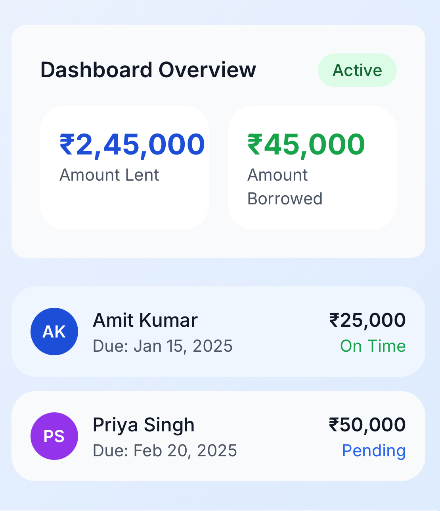
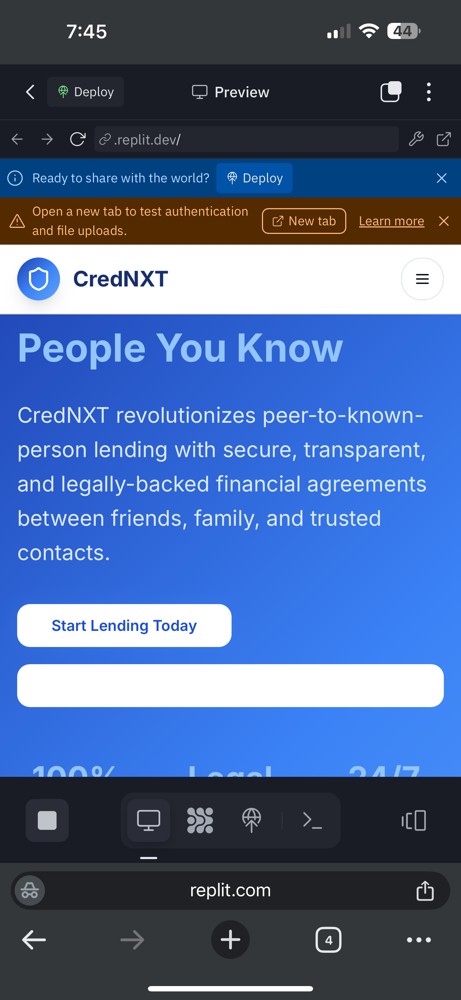
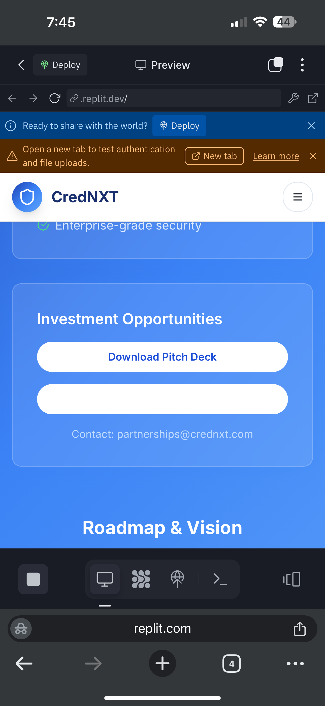

# CredNXT - P2P Lending Platform

<div align="center">
  <h3>Revolutionary Peer-to-Known-Person Lending Platform</h3>
  <p>Transform social lending through secure, transparent, and legally-backed financial agreements</p>
  
  
</div>

## 🚀 Overview

CredNXT is an advanced P2KP (Peer-to-Known-Person) lending platform designed for the Indian financial ecosystem. It enables secure lending between friends, family, and trusted contacts with banking-grade security and legal documentation.

### ✨ Key Features

- **Mobile-First Design**: Responsive PWA optimized for mobile devices
- **Secure Authentication**: JWT with banking-grade security standards
- **Smart Contract Generation**: Automated legal agreements with PDFs
- **Real-time Dashboard**: Live analytics and payment tracking
- **UPI Integration**: Seamless payment processing
- **Multi-frequency Repayments**: Weekly, monthly, quarterly, and more
- **Comprehensive Analytics**: Detailed lending insights

## 🛠 Technology Stack

| Category | Technology |
|----------|------------|
| **Frontend** | React 18, TypeScript, Vite |
| **Styling** | Tailwind CSS, shadcn/ui |
| **Backend** | Express.js, Node.js |
| **Database** | PostgreSQL with Drizzle ORM |
| **Authentication** | JWT, Passport.js |
| **Real-time** | WebSocket connections |
| **Payments** | Stripe, UPI ready |
| **PDF Generation** | PDFKit |

## 📋 Prerequisites

- Node.js 18+ and npm
- PostgreSQL database
- Git

## 🚀 Quick Setup

### 1. Clone & Install
```bash
git clone <your-repository-url>
cd crednxt
npm install
```

### 2. Environment Setup
Copy the environment template:
```bash
cp .env.example .env
```

Configure your environment variables (see [Environment Variables](#environment-variables) section).

### 3. Database Setup
```bash
# Push schema to database
npm run db:push
```

### 4. Start Development
```bash
npm run dev
```

The application will be available at `http://localhost:5000`

## 📦 Available Scripts

| Command | Description |
|---------|-------------|
| `npm run dev` | Start development server with hot reload |
| `npm run build` | Build for production |
| `npm run start` | Start production server |
| `npm run check` | Type check with TypeScript |
| `npm run db:push` | Push schema changes to database |

## 🔧 Environment Variables

Create a `.env` file with the following variables:

### Required
- `DATABASE_URL` - PostgreSQL connection string
- `JWT_SECRET` - Secret key for JWT tokens
- `SESSION_SECRET` - Session encryption secret

### Optional
- `PORT` - Server port (default: 5000)
- `NODE_ENV` - Environment (development/production)
- `STRIPE_SECRET_KEY` - Stripe payment processing
- `TWILIO_ACCOUNT_SID` - SMS notifications
- `TWILIO_AUTH_TOKEN` - SMS authentication
- `TWILIO_PHONE_NUMBER` - Twilio phone number

## 🏗 Project Structure

```
crednxt/
├── client/                 # Frontend React application
│   ├── src/
│   │   ├── components/     # Reusable UI components
│   │   ├── pages/          # Application pages
│   │   ├── lib/            # Utilities and configurations
│   │   └── hooks/          # Custom React hooks
├── server/                 # Backend Express application
│   ├── routes.ts           # API routes
│   ├── storage.ts          # Database operations
│   └── services/           # Business logic services
├── shared/                 # Shared types and schemas
│   ├── schema.ts           # Database schema (Drizzle)
│   └── calculations.ts     # Shared calculations
└── migrations/             # Database migrations
```

## 🎯 Core Features

### Lending Management
- **Create Offers**: Flexible loan terms with multiple repayment options
- **Accept/Decline**: Simple offer management workflow
- **Payment Tracking**: Real-time payment status updates
- **Automated Reminders**: Smart notification system

### Dashboard Analytics
- **Portfolio Overview**: Complete lending/borrowing summary
- **Payment Calendar**: Visual repayment schedule
- **Risk Assessment**: Credit scoring and risk analysis
- **Transaction History**: Detailed financial records

### Security & Compliance
- **Banking-Grade Security**: Multi-layer authentication
- **Legal Documentation**: Auto-generated contracts
- **Audit Trails**: Comprehensive activity logging
- **Data Protection**: GDPR-compliant data handling

## 📱 Screenshots

<div align="center">
  
  
  
</div>

## 🔄 API Documentation

### Authentication Endpoints
- `POST /api/auth/login` - User login with phone
- `POST /api/auth/verify-otp` - OTP verification
- `POST /api/auth/logout` - User logout

### Offers Management
- `GET /api/offers` - List user offers
- `POST /api/offers` - Create new offer
- `GET /api/offers/:id` - Get offer details
- `PUT /api/offers/:id/accept` - Accept offer
- `PUT /api/offers/:id/decline` - Decline offer

### Payments
- `GET /api/payments` - List payments
- `POST /api/payments` - Create payment
- `PUT /api/payments/:id/approve` - Approve payment

## 🧪 Testing

### Running Tests
```bash
# Run all tests
npm test

# Run tests in watch mode
npm run test:watch

# Generate coverage report
npm run test:coverage
```

### Test Structure
- **Unit Tests**: Component and utility testing
- **Integration Tests**: API endpoint testing
- **E2E Tests**: Full workflow testing

## 🚀 Deployment

### Replit Deployment
1. Connect your repository to Replit
2. Configure environment variables
3. Deploy using Replit's deployment service

### Manual Deployment
```bash
# Build the application
npm run build

# Start production server
npm start
```

## 🔧 Development Guide

### Adding New Features
1. Create database schema in `shared/schema.ts`
2. Add storage methods in `server/storage.ts`
3. Create API routes in `server/routes.ts`
4. Build frontend components in `client/src/`

### Code Standards
- **TypeScript**: Strict type checking enabled
- **ESLint**: Code quality enforcement
- **Prettier**: Consistent code formatting
- **Husky**: Pre-commit hooks

## 🐛 Troubleshooting

### Common Issues

**Database Connection Error**
```bash
# Check DATABASE_URL in .env
# Ensure PostgreSQL is running
npm run db:push
```

**Build Failures**
```bash
# Clear node_modules and reinstall
rm -rf node_modules package-lock.json
npm install
```

**Port Already in Use**
```bash
# Change PORT in .env or kill process
lsof -ti:5000 | xargs kill -9
```

## 🤝 Contributing

1. Fork the repository
2. Create feature branch (`git checkout -b feature/amazing-feature`)
3. Commit changes (`git commit -m 'Add amazing feature'`)
4. Push to branch (`git push origin feature/amazing-feature`)
5. Open Pull Request

## 📄 License

This project is licensed under the MIT License - see the [LICENSE](LICENSE) file for details.

## 🙏 Acknowledgments

- [Radix UI](https://radix-ui.com/) for accessible components
- [Tailwind CSS](https://tailwindcss.com/) for styling system
- [Drizzle ORM](https://orm.drizzle.team/) for database management
- [Replit](https://replit.com/) for development platform

## 📞 Support

For support and questions:
- 📧 Email: support@crednxt.com
- 💬 Discord: [CredNXT Community](https://discord.gg/crednxt)
- 🐛 Issues: [GitHub Issues](https://github.com/your-org/crednxt/issues)

---

<div align="center">
  <p>Made with ❤️ for the future of social lending</p>
</div>